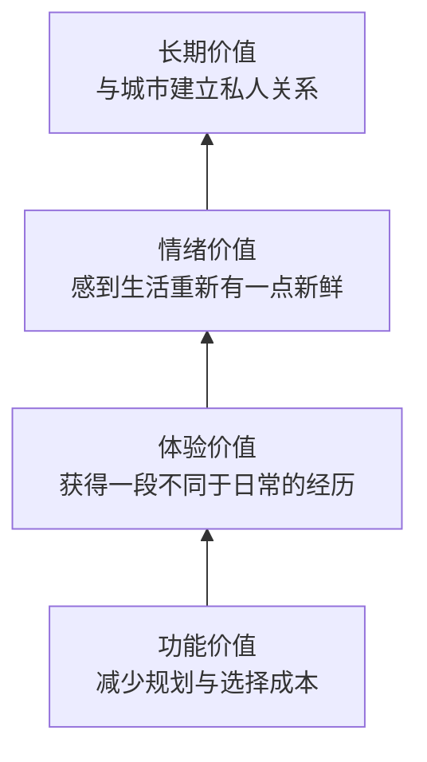
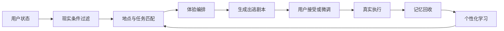
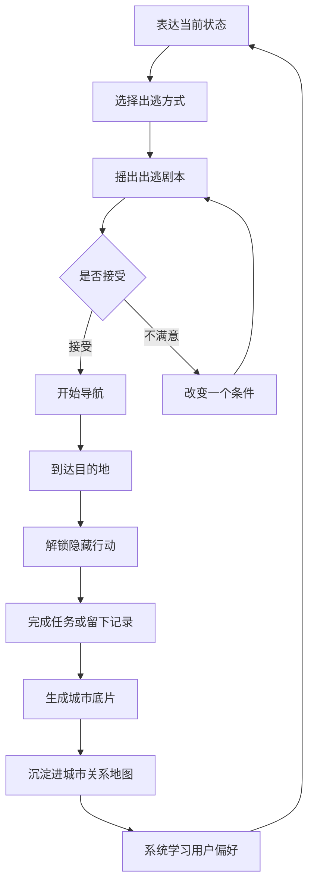
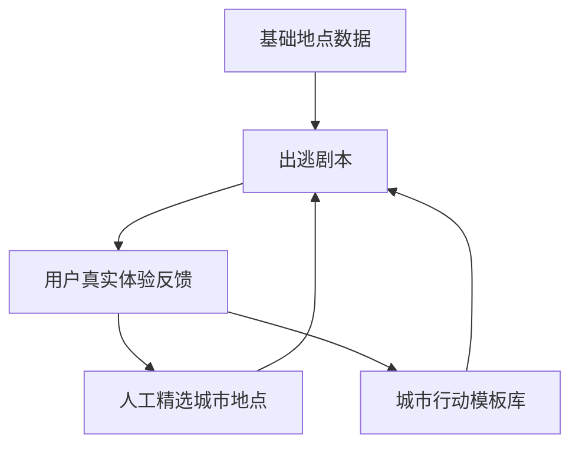
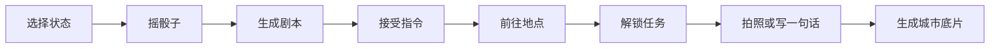
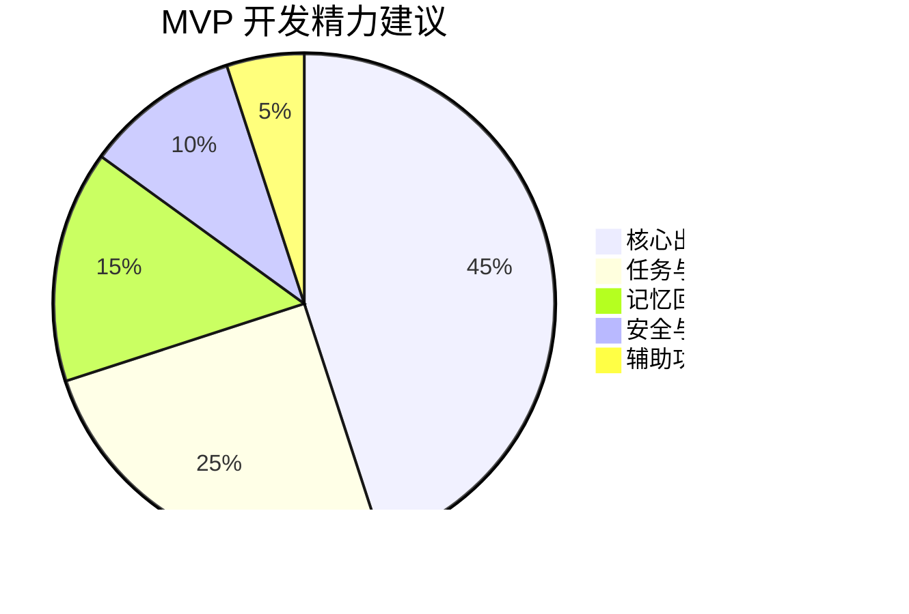
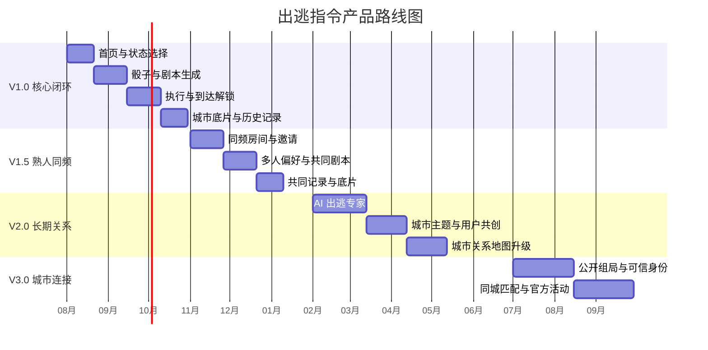
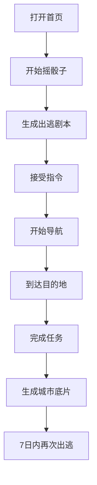

# 出逃指令｜产品总纲与完整功能规划

> **我们不推荐周末去哪里，我们替生活制造一点偏差。**

---

## 目录

1. [项目摘要](#一项目摘要)
2. [产品背景与机会](#二产品背景与机会)
3. [产品概念](#三产品概念)
4. [使命、愿景与价值观](#四使命愿景与价值观)
5. [目标用户与核心场景](#五目标用户与核心场景)
6. [用户痛点与产品价值](#六用户痛点与产品价值)
7. [产品定位与差异化](#七产品定位与差异化)
8. [产品核心机制](#八产品核心机制)
9. [核心用户闭环](#九核心用户闭环)
10. [核心骰子体系](#十核心骰子体系)
11. [完整信息架构](#十一完整信息架构)
12. [完整功能清单](#十二完整功能清单)
13. [AI 出逃专家](#十三ai-出逃专家)
14. [内容与数据体系](#十四内容与数据体系)
15. [安全与信任体系](#十五安全与信任体系)
16. [运营与增长体系](#十六运营与增长体系)
17. [商业化方向](#十七商业化方向)
18. [MVP 规划](#十八mvp-规划)
19. [版本路线图](#十九版本路线图)
20. [数据指标体系](#二十数据指标体系)
21. [风险与应对](#二十一风险与应对)
22. [参赛表达与演示故事](#二十二参赛表达与演示故事)
23. [品牌文案资产](#二十三品牌文案资产)
24. [最终产品总纲](#二十四最终产品总纲)

---

# 一、项目摘要

## 1.1 产品名称

**中文名：出逃指令**  
**英文名：Escape Command**

## 1.2 一句话定义

> 出逃指令是一款面向城市年轻人的城市行动生成小程序。它根据用户当下的位置、时间、预算、情绪、精力和兴趣，为用户生成一段可以立刻执行、带有未知感的城市微冒险。

## 1.3 品牌化定义

> **一个为普通生活制造意外的城市行动生成器。**

## 1.4 产品不是

- 不是另一份城市探店榜单；
- 不是单纯的随机地点推荐器；
- 不是依靠签到和积分驱动的任务软件；
- 不是以陌生人匹配为核心的社交平台；
- 不是要求用户做高难度挑战的“勇敢者游戏”。

## 1.5 产品真正要做的事

> 把用户“有点想出去”的模糊冲动，转化成一条具体、可执行、有情绪价值的行动指令。

最终形成完整链路：

**想出去但不知道做什么 → 接受一条指令 → 真的走出门 → 完成一段体验 → 留下一段私人记忆**

---

# 二、产品背景与机会

## 2.1 用户不缺信息，缺的是行动

城市年轻人拥有大量内容来源：

- 小红书探店攻略；
- 大众点评榜单；
- 抖音城市玩法；
- 地图周边推荐；
- 活动平台和兴趣社群；
- 朋友转发的“周末去哪儿”。

但信息越多，选择成本反而越高。

典型状态是：

> 收藏了很多地点，真正出门时仍然不知道去哪。  
> 周末刷了很久攻略，最后还是留在家里。

## 2.2 现有产品的主要问题

| 产品类型 | 提供的价值 | 缺失的环节 |
|---|---|---|
| 内容平台 | 提供灵感和攻略 | 不能保证用户真正行动 |
| 地图平台 | 提供地点和路线 | 缺少故事感与体验编排 |
| 活动平台 | 提供标准化活动 | 选择成本高、参与门槛高 |
| 打卡产品 | 提供记录与激励 | 容易变成机械任务 |
| 社交平台 | 提供人与人的连接 | 目的性强，陌生社交压力大 |

## 2.3 产品机会

出逃指令所占据的空白是：

> **从“内容推荐”到“真实行动”之间的最后一公里。**

它不再只是回答“哪里值得去”，而是回答：

> **我现在能做什么，才能让今天变得不一样？**

---

# 三、产品概念

## 3.1 什么是“出逃”

“出逃”不是逃避现实，也不是离开城市。

它代表：

- 暂时偏离熟悉的路线；
- 打破重复的生活惯性；
- 进入一个平时不会主动进入的场景；
- 尝试一次不需要过度准备的新体验；
- 为普通的一天增加一点不可预期。

因此：

> **出逃不是离开城市，而是重新进入城市。**

## 3.2 什么是“指令”

“指令”不是冷冰冰的任务清单，而是一种帮助用户降低决策成本的温柔推动。

一个好的出逃指令需要同时满足：

1. **可以执行**：符合用户的现实条件；
2. **有一点意外**：不是用户平时自然会做的事；
3. **不过度冒犯**：不强迫社交，不制造危险；
4. **值得记住**：完成后能留下情绪或故事；
5. **表达有温度**：让用户感到被理解，而不是被命令。

## 3.3 产品核心公式

> **现实约束 × 适度随机 × 行动编排 × 记忆回收 = 一次有效出逃**

其中：

- 现实约束保证“能做”；
- 适度随机保证“意外”；
- 行动编排保证“有内容”；
- 记忆回收保证“值得留下”。

---

# 四、使命、愿景与价值观

## 4.1 产品使命 Mission

> **降低人们开始探索生活的门槛，让每一次想要出门的冲动，都有机会真正发生。**

## 4.2 产品愿景 Vision

> **让每个人都能与自己生活的城市，建立一段私人而有温度的关系。**

长期来看，出逃指令不只是一个周末活动工具，而是一套连接用户、城市、陌生体验和真实关系的生活方式产品。

## 4.3 长期目标

出逃指令希望帮助用户：

- 重新发现熟悉的城市；
- 尝试从未接触过的生活；
- 与朋友共同制造记忆；
- 逐渐形成自己的城市轨迹；
- 在重复的日常里保留好奇心；
- 用更低压力的方式拓展兴趣和关系。

## 4.4 产品价值观

### 行动优先于浏览

用户不是缺少推荐，而是缺少一个迈出门的理由。

### 经历优先于地点

地点只是体验发生的容器，真正重要的是用户在那里做了什么、感受到了什么。

### 意外优先于完美

产品不需要每次找到“全城最佳”，而是要制造一次用户可以接受的轻微偏离。

### 温柔优先于挑战

出逃不一定意味着冒险、社交和突破。一个人走出去二十分钟，也可以是一场出逃。

### 记忆优先于奖励

徽章、积分和连续打卡只能是辅助机制。照片、文字、路线和情绪才是产品应该留下的东西。

### 安全优先于刺激

任何随机和未知，都不能建立在牺牲用户安全与信任的基础上。

---

# 五、目标用户与核心场景

## 5.1 核心用户

生活在一二线城市及年轻人聚集城市的 **18—35 岁用户**。

典型特征：

- 工作日生活节奏固定；
- 周末有时间，但经常不知道做什么；
- 收藏过大量探店、旅行和活动内容；
- 愿意体验新鲜事物，但不喜欢复杂规划；
- 有一定消费能力，但不希望每次出门都高消费；
- 希望认识新朋友，但对陌生人社交有顾虑；
- 重视生活品质、情绪体验和个人成长。

## 5.2 用户类型

### A. 周末迷茫型

**典型表现：**

- 周末醒来后不知道做什么；
- 反复刷攻略却迟迟不出门；
- 最终用外卖、短视频和游戏度过一天。

**核心需求：**

> 替我做决定，并让我现在就能行动。

---

### B. 城市疲惫型

**典型表现：**

- 每天重复通勤；
- 对生活多年的城市逐渐麻木；
- 觉得城市“没什么好玩的”。

**核心需求：**

> 让我重新发现生活多年的城市。

---

### C. 轻度社恐型

**典型表现：**

- 想参加活动、认识朋友；
- 害怕直接进入陌生人社交；
- 不知道如何自然开启一段关系。

**核心需求：**

> 给我一个自然发生连接的理由。

---

### D. 兴趣破圈型

**典型表现：**

- 兴趣和生活圈比较固定；
- 想尝试运动、艺术、桌游等新领域；
- 担心自己不了解规则或显得尴尬。

**核心需求：**

> 让我低门槛地体验另一种生活。

---

### E. 熟人关系维护型

**典型表现：**

- 情侣、朋友或同事经常见面；
- 每次都在重复吃饭、喝咖啡、看电影；
- 想一起做点特别的事，但没有人愿意规划。

**核心需求：**

> 帮我们制造一段真正有内容的共同经历。

---

## 5.3 核心使用场景

| 场景 | 用户状态 | 产品响应 |
|---|---|---|
| 周五下班后 | 不想立刻回家 | 生成 1 小时内、低精力的微出逃 |
| 周末上午 | 有半天时间但没计划 | 生成城市漫游或破圈体验 |
| 情绪低落 | 想出去但不想社交 | 生成近距离、安静、低消费任务 |
| 朋友聚会 | 大家不知道做什么 | 综合多人偏好生成同频剧本 |
| 想尝试新兴趣 | 不知道从哪里开始 | 生成低门槛角色体验 |
| 雨天 | 户外计划无法执行 | 自动切换室内出逃 |
| 出差到陌生城市 | 不想只待在酒店 | 生成短时城市探索任务 |
| 纪念日或生日 | 想留下特别回忆 | 生成具有仪式感的主题剧本 |

---

# 六、用户痛点与产品价值

## 6.1 痛点—方案对应表

| 用户痛点 | 传统解决方式的问题 | 出逃指令的解决方式 |
|---|---|---|
| 不知道周末做什么 | 攻略越多，选择成本越高 | 直接生成一条可执行指令 |
| 收藏很多地点却从不行动 | 内容停留在浏览阶段 | 用时间、任务和悬念推动行动 |
| 城市生活越来越重复 | 推荐内容高度同质化 | 根据用户状态制造轻微偏离 |
| 想尝试新事物但不知道怎么开始 | 新活动信息复杂、门槛高 | 生成低难度的破圈体验 |
| 想和朋友出去但没人组织 | 讨论时间长，意见难统一 | 系统自动综合多人条件 |
| 出门后没有留下什么 | 照片散落，记忆快速消失 | 自动生成城市底片 |
| 陌生社交压力大 | 匹配目的性强、风险高 | 先通过共同任务建立连接 |
| 推荐不符合现实条件 | 忽略天气、距离、营业时间 | 结合实时约束生成方案 |

## 6.2 核心用户价值

可以概括为三个“更容易”：

> **更容易出门，更容易遇见意外，更容易记住生活。**

## 6.3 价值层级

---

# 七、产品定位与差异化

## 7.1 产品定位

> 面向城市年轻人的个性化城市行动生成平台。

## 7.2 核心差异

| 对比维度 | 传统地图/点评 | 内容平台 | 活动平台 | 出逃指令 |
|---|---|---|---|---|
| 核心输出 | 地点 | 灵感和内容 | 标准活动 | 一段行动剧本 |
| 用户决策成本 | 较高 | 很高 | 中等 | 低 |
| 是否结合当前状态 | 弱 | 弱 | 部分 | 强 |
| 是否推动真实行动 | 弱 | 弱 | 中等 | 强 |
| 是否有未知感 | 弱 | 中等 | 弱 | 强 |
| 是否沉淀私人记忆 | 弱 | 中等 | 弱 | 强 |
| 是否适合低门槛出门 | 部分 | 部分 | 较弱 | 强 |
| 关系连接方式 | 无 | 内容互动 | 活动参与 | 共同经历 |

## 7.3 差异化表达

> **其他产品推荐地点，出逃指令设计经历。**

其他产品解决的是：

> “哪里值得去？”

出逃指令解决的是：

> “我现在怎样进入这座城市，才能让今天变得不一样？”

---

# 八、产品核心机制

## 8.1 机制总览

## 8.2 出逃骰子

骰子是核心交互符号，但它不是纯随机工具。

系统综合以下条件：

- 当前城市；
- 实时位置；
- 当前时间；
- 可用时长；
- 可接受距离；
- 预算；
- 天气；
- 情绪；
- 精力；
- 人数；
- 兴趣偏好；
- 历史体验；
- 用户禁忌；
- 地点营业状态；
- 任务难度；
- 安全风险。

最终生成：

> **有随机感，但能够执行的出逃指令。**

## 8.3 出逃剧本

系统不只输出一个地点，而是输出一张完整的“出逃剧本”。

| 字段 | 说明 |
|---|---|
| 出逃标题 | 具有故事感的任务名称 |
| 出逃缘由 | 为什么今天适合做这件事 |
| 预计时间 | 20 分钟、1 小时、半天等 |
| 预计预算 | 免费、50 元以内、100 元以内等 |
| 行动范围 | 楼下、附近、全城 |
| 目的地 | 地点类型或具体地点 |
| 第一阶段指令 | 出发前可查看 |
| 隐藏指令 | 到达现场后解锁 |
| 完成条件 | 拍照、文字、选择或位置确认 |
| 出逃难度 | 温柔、普通、大胆 |
| 安全提醒 | 夜间、天气、交通等 |
| 记忆产物 | 完成后生成的城市底片 |

## 8.4 有限重摇

用户不能无限重摇，否则随机会退化成传统筛选。

不满意时，允许用户只修改一个条件：

- 换一个地点；
- 缩短距离；
- 降低预算；
- 降低难度；
- 改成室内；
- 改成单人；
- 保留地点，换一个任务；
- 保留任务，换一个地点。

推荐文案：

> **不喜欢这条指令？你可以改变一个条件。**

## 8.5 分阶段解锁

### 出发前

展示：

- 目的地；
- 时间和预算；
- 第一条行动；
- 基础安全提示。

### 到达后

解锁：

- 隐藏任务；
- 现场观察；
- 角色任务；
- 第二阶段线索。

### 完成后

解锁：

- 回收问题；
- 城市底片；
- 个性化反馈；
- 下一次建议。

## 8.6 失败也算一次出逃

用户可以：

- 暂停任务；
- 放弃任务；
- 记录“今天停在了哪里”；
- 保留照片或文字；
- 将未完成体验存入城市地图。

产品不通过扣分制造焦虑。

推荐文案：

> **没有完成也算出逃，至少你已经离开了原来的路线。**

---

# 九、核心用户闭环

## 9.1 完整闭环

## 9.2 核心价值闭环

1. **情绪被理解**：用户不需要先想清楚自己想去哪；
2. **决策被接管**：系统给出一个现实可行的选择；
3. **行动被推动**：用户接受后进入明确流程；
4. **体验被设计**：到达后仍有内容，而不是只去一个地点；
5. **记忆被保存**：完成后形成私人城市档案；
6. **下一次更准确**：系统逐步理解用户的出逃风格。

---

# 十、核心骰子体系

## 10.1 微逃骰子

### 定位

为单人、低时间成本、低决策成本的城市探索服务。

### 适用场景

- 下班后不想立刻回家；
- 周末只有一两个小时；
- 突然想出去走走；
- 心情不好但不想社交；
- 想探索住处附近。

### 输入条件

- 20 分钟 / 1 小时 / 半天；
- 免费 / 50 元以内 / 100 元以内；
- 楼下 / 步行范围 / 3 公里内 / 全城；
- 想安静 / 想走走 / 想吃点东西 / 想看看人；
- 温柔 / 普通 / 大胆。

### 任务示例

> 在日落前，走进一家从未去过的小店。不看点评，让店员替你选择一样东西。

> 提前两站下车，沿一条没走过的路回家，拍下途中最像电影画面的地方。

> 找到附近一张可以坐下来的长椅，听完一首歌，再决定下一步往哪个方向走。

---

## 10.2 破圈骰子

### 定位

帮助用户低门槛进入陌生领域，短暂体验另一种身份。

### 核心理念

> 不是让我尝试一个项目，而是让我短暂成为另一种人。

### 可生成角色

- 一小时城市观察员；
- 半天植物学徒；
- 一晚独立电影爱好者；
- 一次桌游新手；
- 一次城市夜行者；
- 一次旧书寻找者；
- 一次街头摄影师；
- 一次轻户外体验者；
- 一次社区志愿者；
- 一次咖啡风味记录员。

### 任务示例

> 今天成为一小时的城市观察员。找一个平时会快速经过的地方，坐十五分钟，记录三种不同的声音。

> 今天成为一名旧书寻找者。去一家旧书店，只根据书名选择一本书，读完第一页，并记下最喜欢的一句话。

---

## 10.3 同频骰子

### 定位

帮助朋友、情侣、同事，或未来的陌生伙伴，共同完成一段城市经历。

### 第一阶段：熟人组局

1. 创建出逃房间；
2. 微信邀请朋友；
3. 每个人匿名提交时间、预算、兴趣和禁忌；
4. 系统综合条件生成方案；
5. 每个人获得不同线索或角色；
6. 所有人到齐后解锁完整任务；
7. 完成后生成共同城市底片。

### 第二阶段：半开放组局

- 用户创建公开计划；
- 限定人数和基础条件；
- 其他用户申请加入；
- 发起人确认；
- 平台提供安全提示与评价机制。

### 第三阶段：平台匹配

- 根据兴趣与历史任务匹配；
- 同城用户参与主题出逃；
- 城市出逃专家组织官方活动。

---

## 10.4 三类骰子对比

| 维度 | 微逃骰子 | 破圈骰子 | 同频骰子 |
|---|---|---|---|
| 核心目标 | 让用户立刻出门 | 体验陌生领域 | 共同制造经历 |
| 主要人数 | 1 人 | 1—2 人 | 2 人及以上 |
| 决策成本 | 最低 | 中等 | 较高 |
| 时间长度 | 20 分钟—半天 | 1 小时—一天 | 1 小时—一天 |
| 社交强度 | 低 | 低—中 | 中—高 |
| 首版优先级 | P0 | P0 | P1 |
| 产品价值 | 行动触发 | 兴趣拓展 | 关系连接 |

---

# 十一、完整信息架构

```mermaid
flowchart TD
    A[出逃指令小程序]

    A --> B[首页]
    A --> C[出逃执行]
    A --> D[城市关系]
    A --> E[我的]
    A --> F[后台运营]

    B --> B1[当前状态]
    B --> B2[微逃骰子]
    B --> B3[破圈骰子]
    B --> B4[同频骰子]
    B --> B5[继续未完成]
    B --> B6[主题出逃]

    C --> C1[出逃剧本]
    C --> C2[导航与到达]
    C --> C3[隐藏任务]
    C --> C4[拍照与记录]
    C --> C5[完成与反馈]

    D --> D1[城市底片]
    D --> D2[记忆地图]
    D --> D3[历史轨迹]
    D --> D4[阶段总结]

    E --> E1[个人资料]
    E --> E2[兴趣与禁忌]
    E --> E3[收藏]
    E --> E4[未完成任务]
    E --> E5[同频伙伴]
    E --> E6[隐私与安全]

    F --> F1[地点管理]
    F --> F2[任务模板]
    F --> F3[剧本配置]
    F --> F4[活动运营]
    F --> F5[反馈审核]
    F --> F6[数据看板]
```

---

# 十二、完整功能清单

> 优先级说明：  
> **P0：首版必须具备**  
> **P1：核心体验增强**  
> **P2：中长期扩展**

---

## 12.1 启动与新用户引导

| 功能 | 功能说明 | 优先级 |
|---|---|---|
| 品牌启动页 | 展示品牌动画、骰子和核心文案 | P0 |
| 微信快捷登录 | 微信授权登录 | P0 |
| 游客体验 | 不登录也可先摇一次骰子 | P1 |
| 城市定位 | 获取当前所在城市 | P0 |
| 精确定位授权 | 生成任务时申请定位权限 | P0 |
| 产品价值引导 | 用 3 页以内解释产品如何使用 | P0 |
| 初始兴趣选择 | 美食、运动、艺术、户外等 | P1 |
| 不喜欢内容 | 排除酒吧、剧烈运动、宠物等 | P1 |
| 常用预算 | 免费、50 元以内、100 元以内 | P1 |
| 常用出行方式 | 步行、骑行、公交、地铁、驾车 | P1 |
| 社交偏好 | 独处、熟人同行、接受轻社交 | P1 |
| 新手体验任务 | 首次进入生成低门槛微出逃 | P0 |
| 隐私说明 | 解释定位、个人信息和数据用途 | P0 |

---

## 12.2 首页

| 功能 | 功能说明 | 优先级 |
|---|---|---|
| 当前状态问候 | 根据时间和天气生成首页文案 | P1 |
| 核心骰子入口 | 页面中心展示出逃骰子 | P0 |
| 快速出逃 | 无需配置，直接生成附近任务 | P0 |
| 出逃方式选择 | 微逃、破圈、同频 | P0 |
| 当前情绪选择 | 无聊、疲惫、想热闹、想安静等 | P0 |
| 可用时间选择 | 20 分钟、1 小时、半天、一天 | P0 |
| 预算选择 | 免费、50 元以内、100 元以内、自定义 | P0 |
| 出逃人数 | 一个人、两个人、多人 | P0 |
| 距离选择 | 楼下、附近、全城 | P0 |
| 精力状态 | 请温柔一点、普通、想大胆一点 | P1 |
| 室内外偏好 | 室内、室外、无所谓 | P1 |
| 当前位置调整 | 修改任务出发点 | P1 |
| 今日主题 | 展示一个运营主题出逃 | P1 |
| 继续未完成 | 返回上一次暂停的出逃 | P0 |
| 最近出逃 | 展示最近生成和完成的任务 | P1 |
| 节日活动入口 | 节日、季节、城市主题活动 | P2 |

---

## 12.3 骰子生成系统

| 功能 | 功能说明 | 优先级 |
|---|---|---|
| 骰子动画 | 摇动、旋转和落点反馈 | P0 |
| 生成加载文案 | 用有趣文案展示匹配过程 | P0 |
| 条件校验 | 判断时间、预算、距离是否冲突 | P0 |
| 天气校验 | 下雨、高温时过滤不适合任务 | P1 |
| 营业时间校验 | 避免推荐关闭地点 | P0 |
| 地点去重 | 减少重复推荐同一地点 | P1 |
| 历史体验去重 | 避免连续出现同类型任务 | P1 |
| 难度匹配 | 根据用户精力匹配任务强度 | P1 |
| 兴趣平衡 | 在偏好与陌生体验之间平衡 | P1 |
| 结果质量评分 | 对生成结果进行可执行性检查 | P1 |
| 安全风险过滤 | 排除高风险地点、时间和任务 | P0 |
| 兜底任务 | 无匹配结果时生成通用附近任务 | P0 |
| 任务解释 | 告诉用户为何推荐这条指令 | P1 |
| 个性化变量替换 | 根据用户状态调整剧本文案 | P1 |

---

## 12.4 出逃剧本详情

| 功能 | 功能说明 | 优先级 |
|---|---|---|
| 剧本名称 | 展示有故事感的任务标题 | P0 |
| 剧本封面 | 自动匹配插画、照片或图形 | P1 |
| 出逃引言 | 一句话说明任务意义 | P0 |
| 时间说明 | 预计时长 | P0 |
| 预算说明 | 预计消费范围 | P0 |
| 距离说明 | 距离和预计交通时间 | P0 |
| 难度说明 | 温柔、普通、大胆 | P0 |
| 人数说明 | 单人、双人、多人 | P0 |
| 目的地预览 | 显示地点类型或具体地点 | P0 |
| 第一阶段任务 | 出发前可见的行动 | P0 |
| 隐藏任务提示 | 告知到达后还有内容 | P0 |
| 接受指令 | 正式进入执行流程 | P0 |
| 改变一个条件 | 有限调整当前方案 | P0 |
| 收藏剧本 | 保存以后完成 | P1 |
| 暂时不出逃 | 保存或放弃当前结果 | P1 |
| 分享剧本 | 分享给朋友查看或参与 | P1 |
| 安全提示 | 夜间、天气、交通提醒 | P0 |
| 地点异常提示 | 营业时间或信息存在不确定性时提示 | P0 |

---

## 12.5 出逃执行

| 功能 | 功能说明 | 优先级 |
|---|---|---|
| 任务进度页 | 展示当前步骤和完成进度 | P0 |
| 地图导航 | 调起地图应用或内置路线 | P0 |
| 预计到达时间 | 展示距离和交通时间 | P0 |
| 到达确认 | 定位判断或手动确认 | P0 |
| 到达后解锁 | 解锁第二阶段隐藏任务 | P0 |
| 文字线索 | 展示现场观察任务 | P0 |
| 图片线索 | 使用局部图片提示寻找目标 | P2 |
| 任务计时 | 记录体验持续时间 | P1 |
| 拍照记录 | 上传现场照片 | P0 |
| 文字记录 | 写一句当下感受 | P0 |
| 语音记录 | 录制短语音 | P2 |
| 情绪记录 | 选择此刻情绪 | P1 |
| 任务完成 | 提交本次出逃 | P0 |
| 暂停任务 | 中途离开，稍后继续 | P0 |
| 放弃任务 | 主动结束任务 | P0 |
| 失败记录 | 未完成也允许留下记录 | P1 |
| 更换地点 | 地点关闭或不可达时切换 | P0 |
| 紧急退出 | 一键结束并返回安全提示 | P0 |
| 分享位置 | 向朋友分享当前任务位置 | P1 |
| 天气变化提示 | 突发天气时给出替代方案 | P2 |
| 离线基础信息 | 弱网状态下保存核心任务信息 | P1 |

---

## 12.6 同频组局

| 功能 | 功能说明 | 优先级 |
|---|---|---|
| 创建出逃房间 | 发起多人出逃 | P1 |
| 微信邀请 | 生成邀请卡片或链接 | P1 |
| 成员列表 | 展示加入状态 | P1 |
| 匿名偏好提交 | 每人独立提交时间、预算和兴趣 | P1 |
| 时间投票 | 自动选择多数人可参与时间 | P1 |
| 预算投票 | 生成共同预算范围 | P1 |
| 出逃风格投票 | 轻松、破圈、挑战 | P1 |
| 多人剧本生成 | 综合成员条件生成方案 | P1 |
| 角色分配 | 拍照者、路线者、线索者等 | P2 |
| 独立线索 | 每个成员看到不同内容 | P2 |
| 到齐确认 | 所有人到达后解锁任务 | P1 |
| 临时退出 | 成员退出后动态调整方案 | P1 |
| 人数不足兜底 | 自动切换适合当前人数的方案 | P1 |
| 共同记录 | 所有人上传照片和文字 | P1 |
| 共同城市底片 | 生成多人版本记忆卡片 | P1 |
| 公开组局 | 发布到同城广场 | P2 |
| 申请加入 | 用户申请参与公开任务 | P2 |
| 发起人审核 | 确认参与成员 | P2 |
| 评价和举报 | 完成后评价参与体验 | P2 |

---

## 12.7 完成与记忆回收

| 功能 | 功能说明 | 优先级 |
|---|---|---|
| 完成动画 | 用仪式感反馈完成任务 | P0 |
| 上传代表照片 | 选择本次出逃封面 | P0 |
| 一句话记录 | 写下最想保留的一句话 | P0 |
| 情绪选择 | 记录出逃前后变化 | P1 |
| 最喜欢的瞬间 | 记录体验高光 | P1 |
| 不舒服的部分 | 反馈任务不合理之处 | P1 |
| 下次难度选择 | 更轻松、保持、再大胆一点 | P1 |
| 自动生成城市底片 | 结合地点、天气、照片和文字生成卡片 | P0 |
| AI 短叙事 | 自动生成生活化回忆 | P1 |
| 自定义修改 | 用户修改生成文案 | P1 |
| 保存到相册 | 将城市底片保存为图片 | P0 |
| 分享给朋友 | 分享小程序卡片 | P0 |
| 设为私密 | 控制是否公开 | P0 |
| 加入城市关系地图 | 将体验沉淀到地图 | P0 |
| 未来提醒 | 一段时间后重新推送这段记忆 | P2 |

---

## 12.8 城市关系地图

> 地图不做普通 POI 查询，而是展示用户和城市之间发生过的关系。

| 功能 | 功能说明 | 优先级 |
|---|---|---|
| 记忆点展示 | 地图展示完成过的出逃 | P0 |
| 未完成点展示 | 区分未完成体验 | P1 |
| 轨迹展示 | 展示出逃路线 | P1 |
| 时间筛选 | 按月份、年份查看 | P1 |
| 情绪筛选 | 查看开心、平静、勇敢等记录 | P2 |
| 类型筛选 | 微逃、破圈、同频 | P1 |
| 点位详情 | 查看照片、文字、天气 | P0 |
| 城区探索比例 | 展示去过的城区和方向 | P2 |
| 城市关系总结 | 生成阶段性探索总结 | P2 |
| 重返旧地点 | 根据旧地点重新生成任务 | P2 |
| 记忆路线 | 将多个点生成回忆路线 | P2 |
| 好友共同地图 | 查看与朋友共同完成的任务 | P2 |

页面命名建议：

- 城市底片；
- 我的城市关系；
- 出逃痕迹；
- 我和这座城市。

---

## 12.9 我的页面

| 功能 | 功能说明 | 优先级 |
|---|---|---|
| 个人资料 | 头像、昵称、城市 | P0 |
| 出逃次数 | 完成、进行中、未完成次数 | P0 |
| 累计时长 | 累计探索时间 | P1 |
| 探索距离 | 累计出逃距离 | P1 |
| 城市底片 | 查看历史记忆卡片 | P0 |
| 我的收藏 | 收藏的任务和地点 | P1 |
| 未完成任务 | 查看暂停和放弃的任务 | P0 |
| 同频伙伴 | 共同参与过任务的朋友 | P2 |
| 出逃风格 | 根据行为生成用户风格 | P2 |
| 兴趣设置 | 修改兴趣标签 | P1 |
| 禁忌设置 | 不接受的地点、时间、活动 | P1 |
| 常用预算 | 设置默认预算 | P1 |
| 常用时间 | 设置出逃习惯 | P2 |
| 隐私设置 | 位置、记录和分享权限 | P0 |
| 黑名单 | 屏蔽用户或活动 | P2 |
| 意见反馈 | 反馈任务和地点问题 | P0 |
| 关于产品 | 品牌故事、协议和帮助 | P0 |

---

## 12.10 轻量激励体系

| 功能 | 功能说明 | 优先级 |
|---|---|---|
| 首次出逃 | 完成第一次任务 | P1 |
| 夜行者 | 完成夜间任务 | P2 |
| 雨天漫游者 | 完成雨天任务 | P2 |
| 城市观察员 | 完成观察类任务 | P2 |
| 破圈新人 | 首次完成陌生领域体验 | P2 |
| 同频伙伴 | 完成多人任务 | P2 |
| 城市方向收集 | 探索不同城区 | P2 |
| 阶段记录 | 不强调连续签到，强调阶段变化 | P2 |
| 年度出逃报告 | 生成年度城市生活报告 | P2 |

不建议使用：

- 断签惩罚；
- 任务失败扣分；
- 强制排名；
- 重度金币体系；
- 为积分诱导用户完成不适合的任务。

---

## 12.11 后台运营与管理

| 功能 | 功能说明 | 优先级 |
|---|---|---|
| 地点管理 | 新增、编辑、上下架地点 | P0 |
| 地点分类 | 管理地点类型和标签 | P0 |
| 地点有效性 | 标记营业状态、风险和更新时间 | P0 |
| 任务模板管理 | 新增、编辑、审核行动模板 | P0 |
| 剧本组合配置 | 配置地点、任务和角色组合规则 | P0 |
| 城市管理 | 管理不同城市的内容范围 | P1 |
| 主题活动管理 | 配置节日、天气和城市主题 | P1 |
| 用户反馈审核 | 处理地点异常和任务问题 | P0 |
| 违规内容审核 | 审核用户上传内容 | P1 |
| 组局审核 | 管理公开组局和举报 | P2 |
| 数据看板 | 查看核心漏斗和完成率 | P0 |
| A/B 测试 | 测试首页、文案和任务结构 | P1 |
| 推荐策略配置 | 调整随机权重和过滤条件 | P1 |

---

# 十三、AI 出逃专家

## 13.1 产品定位

AI 出逃专家不是页面上的普通聊天机器人，而是隐藏在产品背后的：

> **城市体验导演。**

它负责理解用户、过滤现实条件、组合体验，并根据反馈持续优化下一次出逃。

## 13.2 核心能力

### 用户理解

- 长期兴趣；
- 明确禁忌；
- 可接受难度；
- 偏好时间与距离；
- 预算习惯；
- 独处或社交偏好；
- 对陌生体验的接受程度。

### 现实条件理解

- 当前时间；
- 用户位置；
- 天气；
- 交通；
- 营业时间；
- 地点距离；
- 预算；
- 人数；
- 安全程度。

### 体验编排

推荐采用受控生成，而不是完全自由生成：

> **地点类型 + 体验主题 + 行动模板 + 隐藏任务 + 完成方式 + 情绪表达**

### 质量检查

每次生成后，AI 必须检查：

- 是否能在规定时间内完成；
- 预算是否超限；
- 地点是否营业；
- 路线是否合理；
- 是否存在安全风险；
- 是否过于尴尬；
- 是否违反用户禁忌；
- 是否具有明确完成条件；
- 是否具备一定新鲜感；
- 是否与历史任务过度重复。

### 反馈学习

完成后，根据用户反馈调整：

- 同类任务推荐频率；
- 难度；
- 距离；
- 预算；
- 社交强度；
- 室内外偏好；
- 文案表达风格。

## 13.3 用户画像表达

不直接展示复杂标签，而是自然地告诉用户：

> 我发现你不排斥走远一点，但更喜欢安静、有故事的地方。

> 你最近完成了很多一个人的出逃，下次要不要试试和朋友一起？

这样的表达比“兴趣标签：咖啡、摄影、安静”更有温度。

---

# 十四、内容与数据体系

## 14.1 三层内容结构

## 14.2 地点数据库

字段建议：

- 地点名称；
- 地点类别；
- 地址；
- 经纬度；
- 营业时间；
- 联系方式；
- 价格区间；
- 室内或室外；
- 是否适合单人；
- 是否适合多人；
- 是否适合夜间；
- 是否需要预约；
- 无障碍信息；
- 风险等级；
- 数据来源；
- 最近更新时间；
- 用户反馈状态；
- 是否为合作商家。

## 14.3 数据来源

### 第一层：地图平台基础数据

用于：

- 位置；
- 距离；
- 导航；
- 营业时间；
- 地点类型。

### 第二层：人工精选地点

比赛与首版阶段，优先聚焦：

- 一个城市；
- 一个城区；
- 数十到一百个真实可验证地点。

原则：

> **小而真实，比大而空更有说服力。**

### 第三层：用户反馈

用户可反馈：

- 地点已关闭；
- 营业时间错误；
- 价格变化；
- 环境不适合；
- 任务不适配；
- 安全问题；
- 新地点建议。

## 14.4 城市行动模板库

这是产品最重要的内容资产。

每条模板建议包含：

- 模板名称；
- 适用地点类型；
- 适用人数；
- 适用时间；
- 适用天气；
- 预算区间；
- 行动难度；
- 社交强度；
- 体力强度；
- 第一阶段指令；
- 隐藏指令；
- 完成条件；
- 安全限制；
- 情绪价值；
- 不适用人群；
- 可替换变量；
- 用户评分；
- 历史完成率；
- 放弃原因。

示例：

> 进入一家从未去过的店，不看推荐，让店员替你选择一样东西。

可应用于：

- 咖啡店；
- 面包店；
- 书店；
- 花店；
- 文创店；
- 小吃店。

因此，产品真正的核心资产不是单纯的商家库，而是：

> **高质量、可复用、可组合的城市行动模板库。**

---

# 十五、安全与信任体系

## 15.1 基础安全原则

- 夜间任务默认限制距离；
- 极端天气自动暂停户外任务；
- 不推荐偏僻、照明差或风险高的地点；
- 不设计进入私人区域的任务；
- 不要求偷拍或打扰陌生人；
- 不设计危险动作和极限挑战；
- 不鼓励过量饮酒；
- 支持一键结束任务；
- 支持分享位置；
- 支持地点异常反馈；
- 未成年人限制高风险任务；
- 医疗、法律和人身安全相关内容不由 AI 自由生成。

## 15.2 陌生组局安全

- 可信身份认证；
- 组局信息透明；
- 参与者历史记录；
- 举报与拉黑；
- 默认公共场所见面；
- 不展示家庭精确位置；
- 女性用户安全偏好；
- 活动结束后互评；
- 风险关键词和行为识别；
- 必要时取消或下架组局。

## 15.3 权限与隐私

- 定位按需申请；
- 清楚说明数据用途；
- 用户可删除历史位置和记录；
- 私密底片默认仅自己可见；
- 分享前明确展示公开范围；
- 不将用户位置用于无关广告；
- 同频组局中隐藏家庭与公司地址。

---

# 十六、运营与增长体系

## 16.1 主题出逃

- 周五下班不回家计划；
- 雨天出逃；
- 城市日落计划；
- 深夜便利店计划；
- 夏夜散步计划；
- 城市旧书计划；
- 一个人吃饭计划；
- 秋天第一场出逃；
- 和朋友交换生活计划；
- 生日限定出逃；
- 城市声音收集计划。

## 16.2 城市限定任务

不同城市拥有独特剧本：

- 广州骑楼夜行；
- 上海弄堂漫游；
- 成都公园观察；
- 北京胡同声音收集；
- 重庆山城路线挑战；
- 杭州雨天茶馆计划；
- 深圳海边夜行计划。

## 16.3 分享增长

核心分享内容不是“邀请注册领奖励”，而是体验本身：

- 出逃剧本卡片；
- 城市底片；
- 同频房间邀请；
- 城市年度报告；
- 朋友共同路线；
- 今天替朋友摇一次；
- 你和这座城市的关系图。

## 16.4 用户共创

- 用户提交自己的出逃任务；
- 城市体验官审核；
- 优质任务进入公共模板库；
- 原创者获得署名；
- 城市主题任务征集；
- 好友之间发布私人任务；
- 线下共创工作坊。

## 16.5 留存机制

不依赖连续签到，而依赖：

- 阶段性城市关系总结；
- 一个月前的记忆回访；
- 很久没去过的城市方向提醒；
- 根据天气生成的限定任务；
- 与朋友的共同出逃提醒；
- 用户偏好变化反馈；
- 新城市到达后的欢迎出逃。

---

# 十七、商业化方向

> 首版与比赛阶段不必强调盈利，但需要证明产品具有可持续可能。

## 17.1 城市体验付费包

例如：

- 上海雨夜出逃包；
- 广州老城区漫游包；
- 一个人的周末电影包；
- 情侣关系升温任务包；
- 第一次来北京的 3 小时体验包。

## 17.2 会员体系

会员可获得：

- 高级出逃剧本；
- 更深度的 AI 个性化；
- 更多城市底片模板；
- 跨城市数据同步；
- 年度城市关系报告；
- 专属主题任务；
- 高级同频房间能力。

## 17.3 商家合作

合作原则不是出售普通广告位，而是：

> **让商家成为体验发生的场景。**

例如：

- 书店提供隐藏书单；
- 咖啡馆提供随机特调；
- 桌游店提供新手体验局；
- 花店提供植物认识任务；
- 美术馆提供限定观察线索。

必须明确标注合作内容，避免破坏用户信任。

## 17.4 品牌与城市合作

- 城市文化品牌；
- 商场与街区；
- 文旅机构；
- 青年社区；
- 公益机构；
- 运动品牌；
- 艺术节与市集；
- 高校社团。

---

# 十八、MVP 规划

## 18.1 MVP 要验证的核心假设

> **用户是否愿意因为一条有吸引力的随机指令，真正离开当前地点，并完成一次体验？**

## 18.2 MVP 必须完成的核心闭环

## 18.3 P0 功能范围

1. 微信登录；
2. 城市与位置获取；
3. 情绪、时间、预算、距离选择；
4. 微逃骰子；
5. 破圈骰子；
6. 出逃剧本生成；
7. 接受指令；
8. 改变一个条件；
9. 地图导航；
10. 到达确认；
11. 隐藏任务解锁；
12. 拍照与一句话记录；
13. 城市底片生成；
14. 历史出逃记录；
15. 城市关系地图；
16. 任务反馈；
17. 安全提示；
18. 后台任务模板管理；
19. 地点管理；
20. 基础数据统计。

## 18.4 首版暂缓

- 陌生人自动匹配；
- 实时群聊；
- 大规模公开社交广场；
- 全国城市地点覆盖；
- 完整商家评价体系；
- 重度积分和商城；
- 复杂轨迹动画；
- 大量用户动态；
- 完整商业化系统。

## 18.5 MVP 优先级分布

---

# 十九、版本路线图

## 19.1 版本规划

### V1.0：让用户真正出门

目标：

> 验证随机指令能否推动真实行动。

核心内容：

- 微逃骰子；
- 破圈骰子；
- 单人任务；
- 出逃剧本；
- 隐藏任务；
- 城市底片；
- 城市关系地图。

### V1.5：让朋友一起出逃

目标：

> 验证产品能否帮助熟人共同制造经历。

核心内容：

- 同频房间；
- 微信邀请；
- 多人偏好收集；
- 共同剧本；
- 分角色任务；
- 共同城市底片。

### V2.0：让用户建立城市关系

目标：

> 从一次性工具升级为长期生活陪伴产品。

核心内容：

- AI 出逃专家；
- 个性化成长；
- 城市主题任务；
- 回忆提醒；
- 阶段总结；
- 用户共创任务；
- 城市关系地图升级。

### V3.0：让城市中的人产生连接

目标：

> 建立安全、自然、以共同体验为基础的同城关系网络。

核心内容：

- 公开组局；
- 同城兴趣匹配；
- 城市出逃专家；
- 平台主题活动；
- 可信身份与评价体系；
- 城市合作网络。

## 19.2 路线图图表

> 时间仅为规划示意，实际需根据团队资源与比赛节点调整。

---

# 二十、数据指标体系

## 20.1 北极星指标

> **每周成功完成的有效出逃次数**

“有效出逃”建议满足：

- 用户接受指令；
- 实际开始行动或到达地点；
- 完成至少一个核心任务；
- 留下一项记录或反馈。

## 20.2 核心漏斗

## 20.3 关键指标

| 指标 | 定义 | 价值 |
|---|---|---|
| 骰子启动率 | 打开首页后开始生成任务的比例 | 判断首页吸引力 |
| 指令接受率 | 生成后选择接受的比例 | 判断任务吸引力 |
| 条件修改率 | 用户修改一个条件的比例 | 判断匹配准确性 |
| 出发率 | 接受后开始导航的比例 | 判断行动推动力 |
| 到达率 | 开始导航后到达地点的比例 | 判断现实可执行性 |
| 完成率 | 到达后完成核心任务的比例 | 判断体验质量 |
| 底片生成率 | 完成后生成城市底片的比例 | 判断记忆回收价值 |
| 分享率 | 底片或剧本被分享的比例 | 判断传播性 |
| 7 日复用率 | 7 日内再次生成任务的比例 | 判断短期留存 |
| 30 日留存率 | 30 日后仍继续使用的比例 | 判断长期价值 |
| 放弃原因分布 | 用户中断任务的原因 | 指导任务优化 |
| 类似任务意愿 | 是否愿意再次接受同类任务 | 判断内容质量 |

## 20.4 数据看板建议

重点关注四个层级：

1. **生成质量**：任务能否被接受；
2. **行动质量**：用户是否真的出发；
3. **体验质量**：用户是否完成并满意；
4. **长期价值**：用户是否愿意再次回来。

不要把以下指标当作核心成功标准：

- 单纯注册人数；
- 页面浏览量；
- 骰子摇动次数；
- 任务生成总量；
- 徽章领取数。

---

# 二十一、风险与应对

| 风险 | 具体表现 | 应对策略 |
|---|---|---|
| 随机结果不吸引人 | 用户连续重摇 | 有限重摇、提升任务模板质量 |
| 推荐不可执行 | 地点关闭、距离过远 | 营业校验、距离过滤、兜底任务 |
| 产品像普通探店工具 | 只推荐地点 | 强化行动、角色和隐藏任务 |
| 任务太尴尬 | 用户不愿现场执行 | 控制社交强度，提供温柔模式 |
| 内容维护成本高 | 商家信息持续变化 | 聚焦单城、地图数据与人工精选结合 |
| AI 内容不稳定 | 生成危险或空泛任务 | 受控模板生成 + 规则校验 |
| 用户完成率低 | 接受后没有出门 | 缩短任务、加强即时反馈 |
| 记忆功能使用弱 | 用户不愿写长内容 | 只要求一张照片和一句话 |
| 陌生组局安全风险 | 骚扰、欺骗、危险见面 | 后置陌生社交，强化认证和举报 |
| 商业化破坏信任 | 推荐被广告绑架 | 明确合作标识，体验质量优先 |

---

# 二十二、参赛表达与演示故事

## 22.1 项目要解决的问题

> 城市年轻人拥有大量地点信息，却依然不知道周末该做什么。

他们缺少的不是另一份推荐榜单，而是一个能把“想出去”转变为“现在出发”的行动机制。

## 22.2 解决方案

出逃指令根据用户的位置、时间、预算、情绪和兴趣，生成一段可立即执行的城市微冒险。

它不是告诉用户哪里值得去，而是告诉用户：

> **今天可以怎样进入这座城市。**

## 22.3 创新点

### 从地点推荐转向行动生成

不只推荐“去哪里”，而是生成“去那里做什么”。

### 从内容消费转向真实行动

产品核心价值发生在屏幕之外。

### 从纯随机转向约束随机

结合现实条件，让随机既有惊喜又可以执行。

### 从任务完成转向记忆沉淀

完成后生成城市底片，让体验成为用户与城市关系的一部分。

### 从目的性社交转向共同经历

通过共同任务，让关系自然发生。

## 22.4 比赛演示故事

> 周五晚上七点半，一个刚下班的年轻人坐在地铁里。  
>
> 他不想马上回家，但也不知道应该去哪里。收藏夹里有上百家店，可他已经没有精力继续做攻略。  
>
> 他打开「出逃指令」，选择：一个人、一小时、50 元以内、今天有点累。  
>
> 骰子为他生成了一次微出逃：提前两站下车，去一家从未去过的小店，不看点评，让店员替他选择晚餐。  
>
> 到达后，第二条指令解锁：坐在一个平时不会选择的位置，拍下一张最像电影画面的照片。  
>
> 一个小时后，他没有获得金币，也没有升级。  
>
> 产品为他生成了一张城市底片：  
>
> **“2026 年 7 月 25 日，你在一个普通的周五晚上，提前两站下了车。你说，原来每天经过的城市，还有一些地方在等你慢下来。”**  
>
> 出逃指令希望做的，就是让这样的瞬间更容易发生。

---

# 二十三、品牌文案资产

## 23.1 核心品牌主张

推荐主版本：

> **我们不推荐周末去哪里，我们替生活制造一点偏差。**

其他版本：

> 出逃不是离开城市，而是重新进入城市。

> 给你的周末一个随机出口。

> 偏离熟悉的路线，遇见生活的另一种可能。

> 今天，去过一点不一样的生活。

> 不做攻略，接受一次意外。

## 23.2 品牌关键词

- 好奇；
- 随机；
- 温柔；
- 城市；
- 陪伴；
- 行动；
- 未知；
- 记忆；
- 年轻；
- 松弛。

## 23.3 品牌人格

出逃指令像一个：

> **有一点神秘、有一点浪漫，但非常懂分寸的城市朋友。**

它不会强迫用户挑战自己，而是轻轻推用户一把。

## 23.4 首页文案示例

### 通用

> 今天想从什么里逃出去？

> 现在，给生活一点偏差。

> 你不需要想好去哪，只需要决定要不要出发。

### 下班后

> 今天辛苦了，要不要先不回家？

> 下班后的城市，还有一小段时间属于你。

### 周末

> 周末不一定要有计划，但可以有一个出口。

> 别再刷攻略了，今天让骰子替你决定。

### 情绪低落

> 今天不想挑战自己也没关系，我们走近一点。

> 不需要变得更好，先出去透一口气。

## 23.5 生成中

> 正在替你避开熟悉的路线……

> 正在寻找一件不太像今天会发生的事……

> 正在让时间、天气和一点点运气达成一致……

> 城市正在为你打开一个小出口……

## 23.6 任务调整

> 出逃不必完全听话，但请至少保留一点意外。

> 不喜欢这条指令？你可以改变一个条件。

> 地点可以换，但别把所有未知都拿走。

## 23.7 未完成任务

> 没有完成也算出逃，至少你已经离开了原来的路线。

> 今天停在这里也没关系，我们替你把它记下来。

## 23.8 完成任务

> 城市没有突然变得有趣，只是你今天换了一种进入它的方式。

> 今天的生活偏离了一点，但刚刚好。

> 这不是一次打卡，是你和城市之间多出来的一段关系。

---

# 二十四、最终产品总纲

## 产品是什么

> 一个为普通生活制造意外的城市行动生成器。

## 产品解决什么问题

> 解决城市年轻人“想出去，却不知道做什么，也不想继续规划”的现实困境。

## 产品如何解决

> 将用户当下的情绪和现实限制，转化为一条可以立即执行的城市出逃剧本。

## 产品最大的差异

> 其他产品推荐地点，出逃指令设计经历。

## 产品最终留下什么

> 不是签到、积分和消费记录，而是用户与一座城市之间逐渐形成的私人关系。

## 产品未来会成为什么

> 一个理解用户状态、为用户设计真实生活体验，并帮助人与城市、人与兴趣、人与人产生连接的城市生活平台。

## 最终结语

> **随机只是形式，帮助用户重新感受生活，才是出逃指令真正的价值。**
