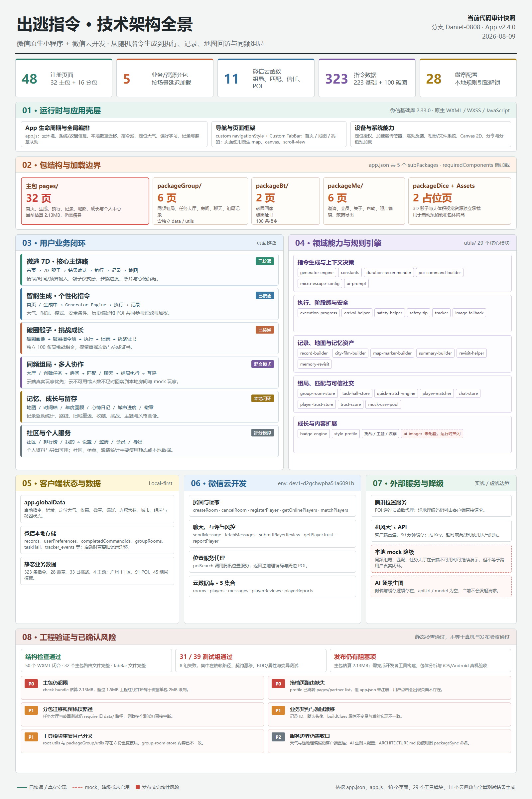
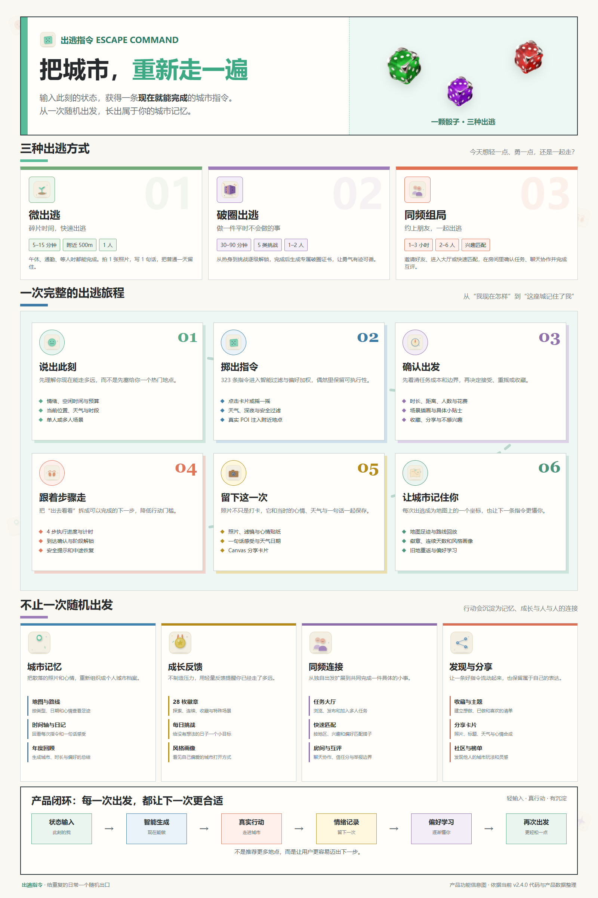

# 出逃指令｜复赛完整产品说明与技术实践

> 参赛作品：出逃指令
>
> 作品形态：微信小程序
>
> 作品定位：随机骰子驱动的城市探索与记忆记录产品
>
> 当前版本：复赛版 v2.4.0
>
> 文档用途：复赛作品介绍、产品演示、技术实践与团队协作说明

---

## 0. 一句话介绍

**出逃指令**是一款给城市年轻人的微信小程序：当你又一次在“去哪儿”和“要不要出门”之间来回犹豫时，掷一颗骰子，接住一条此刻做得到的城市指令；走出去，完成它，再用一张照片和一句话，把这次出门留在自己的城市地图上。

> 不替你找到最好的地方，只帮你在犹豫结束之前，先走出门。

---

## 1. 团队介绍

### 1.1 我们是谁

| 成员 | 主要职责 | 负责内容 |
|:---|:---|:---|
| Daniel（DaNie1） | 产品统筹、核心逻辑与工程协作 | 用户问题定义、产品方案、指令生成引擎、数据流、云函数联调、测试与项目推进 |
| Henry_yan | 创意策划、玩法逻辑与整体方案 | 破圈玩法、同频组局、任务机制、活动创意、产品体验逻辑与内容设计 |
| chenhao（CH） | 前端实现、交互视觉与设计落地 | 页面布局、交互样式、设计规范、视觉素材、前端体验和多端适配 |

### 1.2 为什么是我们

我们三个人来自不同的生活场景，但都遇到过同一个问题：

周末明明有一点时间，却不想再花一小时做攻略；想出门，却很难说清楚自己到底想去哪；想认识新朋友，却不想从一场复杂的社交活动开始。

Daniel 是一个典型的“想出门，但常常卡在决定之前”的人。Henry 擅长把一件小事变成一场有人愿意参与的活动。CH 关注产品如何被真正使用，以及一个页面能不能让人愿意多停留一秒。

出逃指令不是凭空设计出来的功能集合，而是三个人把各自真实的生活困扰，压缩成了一个可以马上使用的小工具。

### 1.3 团队协作方式

我们使用 AI 辅助完成需求拆解、代码实现、测试用例和问题定位，但不把 AI 生成的代码视为天然正确。

团队采用以下协作方式：

1. 先由人定义用户问题、体验目标和验收标准。
2. 将需求拆解成可以独立实现和验证的功能模块。
3. 使用 TRAE 辅助生成代码、测试和初版方案。
4. 在微信开发者工具和真机中验证真实交互。
5. 由团队成员进行代码 Review、边界检查和视觉检查。
6. 每个功能通过分支和 Pull Request 合并，避免 AI 生成的临时代码直接进入主分支。

AI 提高了实现速度，但产品方向、交互取舍、风险边界和最终合并决定仍由人负责。

### 1.4 初赛作品

初赛作品：[生活娱乐赛道｜出逃指令——给你的周末一个随机出口](https://forum.trae.cn/t/topic/147520?u=danie1)

初赛主要验证“骰子—指令—执行—记录”的核心闭环；复赛在此基础上扩展了安全、记忆、成长和多人协作能力。

---

## 2. 产品简介

### 2.1 我们为什么做它

我们不想再做一个更大的攻略库。

攻略告诉你哪里值得去，却很少帮你真正出门。选择越多，比较越久，最后反而更难行动。很多人的周末并不是没有时间，而是不想把半天时间继续花在“决定去哪”上。

所以，出逃指令把：

> 搜索 → 比较 → 决定

缩短成：

> 输入状态 → 掷出指令 → 走出去 → 留下记录

骰子并不比搜索引擎更聪明。它的价值在于，当我们已经被太多选项困住时，替我们暂时拿走“还要不要继续比较”的负担。

随机也不是放弃判断，而是在安全、时间和距离的边界之内，把生活交给一次小小的偶然。

### 2.2 产品是什么

用户打开小程序后，可以从三个首页入口开始：

- **微出逃**：适合午休、通勤、等人和下班后的碎片时间。
- **破圈出逃**：通过分级挑战，做一件平时不太会做的事。
- **同频组局**：邀请朋友、加入任务大厅或匹配同频搭子，一起完成一件具体的小事。

系统会综合情绪、空闲时间、预算、当前位置、天气、时段、历史完成记录和用户偏好，筛选一条当前更容易执行的指令。

接受指令后，用户按照四步引导完成任务，过程中可以查看时长、距离、人数、执行进度和安全提示。完成后，用户拍照、选择滤镜和心情贴纸，写下一句话感受，生成一张属于自己的拍立得分享卡。

这次出门不会随着手机锁屏而消失。它会成为地图上的一个坐标、一枚徽章、一段时间轴，也会慢慢让下一次推荐更了解你。

### 2.3 产品边界

出逃指令不是旅游攻略平台，也不是心理咨询工具，更不是用复杂数据替用户规划人生的系统。

它只解决一个更小、更具体的问题：

> 当你想出门，却卡在“现在到底做什么”时，给你一个可以马上开始的答案。

个人记录采用本地优先的方式保存；定位、天气、POI 和组局等功能，会在用户使用对应能力时调用相关服务。核心指令和记录在离线情况下仍可以使用，但天气、附近地点和多人组局需要网络支持。

### 2.4 面向谁

我们的主要用户不是旅行发烧友，而是“有时间，却不想再花时间做计划”的城市年轻人。

#### 城市白领

周五晚上刷攻略，周六上午继续比较，到了下午仍然没有出门。

#### 独居青年

有一点想探索城市，却缺少一个足够轻的出门理由。

#### 轻度社交用户

不想参加大型活动，但愿意和一两个人一起完成一件具体的小事。

#### 想突破舒适区的人

知道自己应该多尝试，却总是在真正出发前把自己劝回去。

### 2.5 我们解决的不是“去哪”，而是“不行动”

用户的真实阻力通常不是信息不足，而是信息太多：

- 选择太多，无法判断。
- 计划太重，不想开始。
- 体验太散，完成后很快忘记。
- 一个人出门缺少动力，组局又需要太多沟通。

出逃指令对应地提供四种产品价值：

| 用户阻力 | 产品回应 |
|:---|:---|
| 不知道做什么 | 用骰子把选择压缩成一条指令 |
| 不知道能不能完成 | 展示时长、距离、人数、花费和安全边界 |
| 走出去以后很快忘记 | 用照片、心情、文字和地图沉淀记忆 |
| 想和别人一起出发 | 用任务大厅、房间和匹配降低组局门槛 |

---

## 3. 核心产品体验

### 3.1 三种出逃方式

| 模式 | 适合场景 | 核心体验 | 当前入口 |
|:---|:---|:---|:---:|
| 微出逃 | 午休、通勤、等人、下班后 | 5—15 分钟，附近的小任务 | 已接入 |
| 破圈出逃 | 周末、低落、想尝试新事物 | 30—90 分钟，分级挑战与破圈证书 | 已接入 |
| 同频组局 | 朋友聚会、想认识新朋友 | 任务大厅、房间、聊天和匹配 | 混合模式 |

智能匹配是贯穿推荐链路的默认策略。深夜、雨天和双人能力属于条件规则或扩展能力，不再作为首页单独展示的第四、第五颗骰子。

### 3.2 一次完整的出逃旅程

```text
说出此刻
    ↓
掷出指令
    ↓
确认出发
    ↓
跟着步骤走
    ↓
留下这一次
    ↓
让城市记住你
```

#### 第一步：说出此刻

系统读取或接收用户的情绪、时间、预算、位置、天气和时段信息，先理解“现在适合做什么”。

#### 第二步：掷出指令

用户可以点击骰子，也可以摇一摇手机。系统经过类型、时间、天气、安全、位置和偏好过滤后，生成一条指令。

#### 第三步：确认出发

指令详情卡展示类型、标题、场景插画、时长、距离、人数、花费、小贴士和推荐理由。用户可以重摇、收藏、关闭或接受。

#### 第四步：跟着步骤走

执行页将任务拆成四步，展示当前进度、已探索时间、到达确认、安全提示和中途恢复能力。

#### 第五步：留下这一次

完成任务后，用户可以选择照片、滤镜、心情贴纸并编辑一句话感受，生成拍立得记录卡和 Canvas 分享卡。

#### 第六步：让城市记住你

完成记录会进入地图、时间轴、心情日记、城市进度和徽章体系，并参与后续偏好学习。

### 3.3 产品体验的三个关键判断

#### 随机，但不是胡乱随机

骰子负责制造意外，规则负责保证可执行。随机结果必须满足时间、天气、距离和安全边界。

#### 轻量，但不是浅薄

一条指令可以只需要十分钟，但照片、文字和心情让这十分钟拥有可回看的重量。

#### 有趣，但不强迫社交

用户可以独自完成，也可以邀请朋友或进入组局。社交是可选择的出口，不是使用产品的前提。

---

## 4. 完整功能清单

### 4.1 功能状态说明

| 标记 | 含义 |
|:---:|:---|
| ✅ | 当前版本可以直接体验 |
| ◐ | 已有页面或基础逻辑，依赖本地兜底、云环境或真实账号验证 |
| △ | 已完成产品设计或基础封装，当前版本未正式接入 |
| — | 不作为当前版本对外功能 |

### 4.2 首页与指令生成

| 功能 | 说明 | 初赛 | 复赛 |
|:---|:---|:---:|:---:|
| 三种骰子入口 | 微出逃、破圈出逃、同频组局 | ✅ | ✅ |
| 智能问候栏 | 时间、位置、天气一行展示 | ✅ | ✅增强 |
| 点击与摇一摇 | 点击触发和加速度传感器触发 | ✅ | ✅ |
| 随机指令生成 | 多层过滤和兜底机制 | ✅ | ✅重写 |
| 指令评分 | 兴趣、难度、新鲜度、时长、类型平衡综合评分 | ✅ | ✅升级 |
| 推荐理由 | 根据天气、深夜、偏好和环境生成“为什么推荐它” | — | ✅ |
| 动态加载文案 | 按模式、时长、天气展示加载文案 | — | ✅ |
| 换卡机制 | 每日换卡次数和重摇入口 | ✅ | ✅ |
| 附近 POI 注入 | 根据位置补充真实地点信息 | — | ◐ |

### 4.3 模式与条件规则

| 功能 | 说明 | 状态 |
|:---|:---|:---:|
| 智能匹配 | 默认推荐策略，结合用户当下状态和历史偏好 | ✅ |
| 微出逃 | 碎片时间和附近短任务 | ✅ |
| 城市漫游 | 较长时长和更深度的户外探索 | ✅ |
| 双人出逃 | 邀请朋友完成任务 | ◐ |
| 深夜规则 | 夜间安全过滤和距离限制 | ✅ |
| 雨天规则 | 优先推荐室内任务，过滤不适合户外的指令 | ✅ |
| 破圈骰子 | 100 条专属指令和五类挑战 | ✅ |
| 指令类型 | color、walk、sense、collect、food、culture、breakthrough、custom | ✅ |

### 4.4 执行与记录

| 功能 | 说明 | 初赛 | 复赛 |
|:---|:---|:---:|:---:|
| 四步引导 | 从出门、找到目标、完成动作到记录感受 | ✅ | ✅增强 |
| 类型差异化步骤 | 不同类型指令使用不同执行步骤 | — | ✅ |
| 计时器与进度条 | 展示已探索时长和预计时长进度 | ✅ | ✅ |
| 拍照 | 相机和相册入口，最多三张 | ✅ | ✅ |
| 完成按钮 | 完成必要步骤后才允许结束 | ✅ | ✅ |
| 拍立得记录卡 | 照片、心情、感受、日期、天气 | ✅ | ✅增强 |
| 滤镜 | 日光、阴雨天、闪光灯等风格 | ✅ | ✅ |
| 心情贴纸 | 开心、平静、惊喜、治愈、好玩等 | ✅ | ✅增强 |
| Canvas 分享卡 | 600×900 矢量绘制、文字换行、圆角裁剪 | — | ✅ |
| 保存流程 | 保存、成功反馈、保存到相册和分享入口 | ✅ | ✅重写 |

### 4.5 安全体系

| 功能 | 说明 | 状态 |
|:---|:---|:---:|
| 紧急退出 | 退出当前执行，保留进度，支持后续恢复 | ✅ |
| 极端天气阻断 | 暴雨、雪天等情况下过滤危险户外指令 | ✅ |
| 夜间距离限制 | 使用球面距离计算限制深夜户外距离 | ✅ |
| 目的地位置查看 | 使用微信位置能力打开目的地 | ◐ |
| 安全知识 | 提供 110、120、119、122 等紧急联系方式 | ✅ |
| 授权边界 | 定位拒绝、超时、离线和缓存失效均有兜底 | ◐ |

### 4.6 记忆地图

| 功能 | 说明 | 初赛 | 复赛 |
|:---|:---|:---:|:---:|
| 地图视图 | 普通地图、卫星地图和路线模式 | ✅ | ✅增强 |
| 多维筛选 | 按时间、类型和心情筛选记录 | — | ✅ |
| 标记样式 | 六种类型对应不同颜色和手绘风格图标 | ✅ | ✅增强 |
| 标记聚合 | 多条记录聚合显示 | ✅ | ✅ |
| 标记详情 | 标题、日期和心情 | ✅ | ✅ |
| 定位与刷新 | 定位当前位置和刷新数据 | ✅ | ✅ |
| 统计卡 | 出逃次数、探索角落、徽章数、连续天数 | ✅ | ✅ |
| 路线回访 | 查看曾经完成过的地点和路线 | — | ✅ |

### 4.7 破圈出逃

| 功能 | 说明 | 状态 |
|:---|:---|:---:|
| 破圈画像 | 街头社死、身份偷换、随机命运、反向世界、极限忍耐五类 | ✅ |
| 100 条专属指令 | 每类 20 条，带分级挑战内容 | ✅ |
| 场景插画 | 破圈指令匹配专属场景插画 | ✅ |
| 勇气进度 | 通过完成记录积累挑战反馈 | ◐ |
| 破圈证书 | 紫色风格证书，记录类别与完成信息 | ✅ |

### 4.8 同频组局

| 功能 | 说明 | 状态 |
|:---|:---|:---:|
| 任务大厅 | 浏览、加入和筛选出逃任务 | ◐ |
| 创建任务 | 自定义主题、区域、地点、人数和时间偏好 | ◐ |
| 房间系统 | 创建房间、成员状态和任务状态机 | ◐ |
| 房间聊天 | 房间内消息发送与拉取 | ◐ |
| 快速匹配 | 按地区、兴趣和偏好匹配搭子 | ◐ |
| 信任评分 | 基于完成、互动和评价形成信任层级 | ◐ |
| 本地模拟搭子 | 云端玩家不足或不可用时的演示兜底 | ◐ |
| AI 生成任务 | 当前仅保留产品方向，未作为现版正式能力 | △ |

### 4.9 徽章、成长与扩展页面

| 功能 | 说明 | 状态 |
|:---|:---|:---:|
| 28 枚徽章 | 里程碑、类型、模式、社交和特殊徽章 | ✅ |
| 城市方向徽章 | 东征、南探、西行、北游、中枢等城市方向 | ✅ |
| 徽章检测引擎 | 根据记录、类型、模式和连续天数解锁 | ✅ |
| 徽章详情 | 名称、描述、解锁日期和状态 | ✅ |
| 年度回顾 | 次数、距离、徽章、心情和照片回顾 | ✅ |
| 心情日记 | 按心情查看历史记录 | ✅ |
| 城市进度 | 已探索角落和目标进度 | ✅ |
| 每日挑战 | 主题挑战与完成反馈 | ✅ |
| 主题市场 | 四套主题切换 | ✅ |
| 收藏 | 收藏、取消收藏和空状态 | ✅ |
| 社区动态 | 记忆墙和内容浏览，当前以本地数据为主 | ◐ |
| 排行榜 | 周/月维度的本地展示能力 | ◐ |
| 数据导出 | 导出长图、年度报告和 JSON 数据 | ✅ |
| AI 场景生图 | 已有封装和缓存逻辑，接口未配置 | △ |

---

## 5. 用户使用路径

### 5.1 首次使用

```text
首次打开
  ↓
一屏引导：随机、行动、记录
  ↓
进入首页
  ↓
授权定位或跳过
  ↓
看到时间、位置、天气和当前推荐
```

### 5.2 核心使用路径

```text
打开首页
  ↓
选择微出逃 / 破圈出逃 / 同频组局
  ↓
点击骰子或摇一摇
  ↓
骰子反馈 + 加载文案
  ↓
指令卡滑入
  ↓
查看时长、距离、人数、场景和小贴士
  ↓
重摇 / 收藏 / 关闭 / 接受
  ↓
执行页：四步引导 + 计时器 + 安全入口
  ↓
完成步骤并拍照
  ↓
记录页：滤镜 + 心情贴纸 + 一句话感受
  ↓
保存拍立得分享卡
  ↓
地图足迹 + 徽章 + 偏好学习
```

### 5.3 三种典型场景

#### 场景 A：午休时的微出逃

用户只有十几分钟，不想搜索地点。打开微出逃，系统结合附近位置生成一条短任务，完成后拍照记录，回到工位时已经拥有了一次小小的离开。

#### 场景 B：周末想做点不一样的事

用户进入破圈出逃，填写或确认自己的挑战画像，掷出一条带有具体行动步骤的任务。完成后获得破圈证书，知道自己确实做过一次平时不会做的事。

#### 场景 C：想见朋友，但没人想做计划

用户进入同频组局，创建或加入一个具体任务。大家不需要先决定一整天去哪，只需要先同意一起完成一件小事。

---

## 6. 复赛版本的核心升级

初赛 Demo 证明了“骰子 + 指令 + 记录”的核心想法成立。复赛版重点解决三个问题：

### 6.1 工程化升级

- 将指令生成逻辑从页面和全局状态中抽离为纯函数引擎。
- 建立 5 个分包，承载组局、破圈、扩展页面和视觉资源。
- 增加记录迁移、图片加载兜底、执行进度恢复和数据统一处理。
- 增加单元测试、BDD、属性测试、对抗式测试和包体检查。

### 6.2 内容与玩法升级

- 基础指令池从初赛规模扩展到 223 条。
- 新增 100 条破圈指令，总指令数据达到 323 条。
- 指令类型扩展为 8 类。
- 徽章从 9 枚扩展到 28 枚。
- 新增破圈出逃、同频组局、每日挑战和城市方向徽章。

### 6.3 体验闭环升级

- 从“随机给任务”升级为“解释为什么推荐”。
- 从“完成任务”升级为“按步骤完成并获得阶段反馈”。
- 从“拍照保存”升级为“照片 + 心情 + 文字 + 天气 + 地图”。
- 从“一次性使用”升级为“地图、徽章、回顾和偏好学习”。

### 6.4 当前版本的真实边界

为了保证作品介绍和实际体验一致，当前版本需要明确以下边界：

- 个人记录以本地存储为主。
- 组局、聊天、玩家匹配和信任评分属于本地与云端混合能力。
- 云端不可用或缺少真实玩家时，部分社交流程会使用本地模拟数据兜底。
- 社区和排行榜当前主要用于本地展示与原型验证。
- AI 场景生图封装已存在，但当前没有配置真实接口。
- AI 个性化指令生成属于后续规划，不应在演示中描述为当前已接通能力。

---

## 7. 产品演示视频方案

### 7.1 视频目标

用一条完整的用户旅程证明：这不是一个只能展示首页的 Demo，而是一款可以从“产生犹豫”走到“完成记录”的产品。

建议时长：60—90 秒。

### 7.2 分镜与脚本

| 时间 | 画面 | 旁白 / 字幕 |
|:---:|:---|:---|
| 0—8 秒 | 手机里打开多个攻略页面，用户反复滑动，最后锁屏 | “周末不是没有时间，只是决定去哪，已经花掉了所有力气。” |
| 8—16 秒 | 打开出逃指令首页，展示问候栏和三种骰子入口 | “出逃指令，把选择压缩成一次出发。” |
| 16—28 秒 | 选择微出逃，点击或摇一摇，骰子动画，指令卡出现 | “输入此刻的状态，掷出一条现在就能完成的城市指令。” |
| 28—40 秒 | 展示指令详情、时长、距离、人数、步骤和安全提示 | “你可以先看清它要花多少时间、走多远，再决定是否接受。” |
| 40—52 秒 | 执行页展示四步进度，用户完成任务并拍照 | “把‘出去走走’拆成下一步，行动就没有那么重。” |
| 52—65 秒 | 记录页选择滤镜、心情贴纸、编辑一句话，生成拍立得卡片 | “照片不是打卡，是给这一次出门留下一个证据。” |
| 65—75 秒 | 地图出现新足迹，徽章解锁，时间轴和心情记录快速切换 | “一次出门不会消失，它会变成地图上的一个坐标。” |
| 75—85 秒 | 快速展示破圈出逃和同频组局 | “想独自出发，可以。想和别人一起，也可以。” |
| 85—90 秒 | 回到骰子和城市画面，出现产品名 | “有时候，我们和城市之间缺的不是一条路，而是一个出门的理由。” |

### 7.3 拍摄注意事项

- 必须录出完整链路：首页、掷骰、详情、执行、记录、地图。
- 录制真实加载反馈和动画，不要只用静态截图拼接。
- 演示组局时说明真实云端能力与本地兜底边界。
- 不展示 API Key、测试密钥、用户隐私和本机配置。
- 视频结尾给出体验入口、二维码或体验版信息。

---

## 8. 技术实现方案

### 8.1 技术栈

| 层级 | 技术选型 |
|:---|:---|
| 前端框架 | 微信小程序原生 WXML / WXSS / JavaScript |
| 导航结构 | 自定义导航栏 + Custom TabBar |
| 样式方案 | WXSS、CSS 变量、运行时主题切换 |
| 状态管理 | app.globalData + 微信本地存储 |
| 个人数据 | 本地优先，启动时兼容旧记录并进行迁移 |
| 云端能力 | 微信云开发，承载 POI 代理、组局、玩家、聊天和信任数据 |
| 地图 | 微信原生 map 组件 + 腾讯地图 WebService |
| 天气 | 和风天气 API，30 分钟本地缓存，失败时使用兜底 |
| POI | 微信云函数代理腾讯地图 POI 查询 |
| 分包 | packageGroup、packageBt、packageDice、packageAssets、packageMe |
| 字体 | 本地 WOFF2 + wx.loadFontFace |
| 分享卡 | Canvas 2D，600×900 矢量绘制 |
| 指令引擎 | 纯函数 JavaScript，核心逻辑可脱离 wx 环境测试 |
| 安全规则 | 时间、天气、距离、营业条件和任务内容过滤 |
| 测试 | Node 单元测试、BDD、属性测试、对抗式测试、包体检查 |

### 8.2 技术架构图



> 上传到比赛社区或飞书文档时，请将 `docs/escape-command-technical-architecture.png` 作为附件插入。

### 8.3 产品功能图



> 上传到比赛社区或飞书文档时，请将 `docs/escape-command-product-infographic.png` 作为附件插入。

### 8.4 核心数据流

```text
用户状态
  ├─ 情绪
  ├─ 时间
  ├─ 预算
  ├─ 位置
  ├─ 天气
  └─ 历史偏好
       ↓
指令生成引擎
  ├─ 类型过滤
  ├─ 时间过滤
  ├─ 天气过滤
  ├─ 安全过滤
  ├─ POI 条件
  ├─ 已完成去重
  └─ 偏好加权
       ↓
指令详情卡
       ↓
执行进度
  ├─ 四步引导
  ├─ 计时器
  ├─ 到达确认
  ├─ 安全提示
  └─ 中途恢复
       ↓
记录构建器
  ├─ 照片
  ├─ 滤镜
  ├─ 心情贴纸
  ├─ 一句话感受
  ├─ 日期与天气
  └─ 指令快照
       ↓
本地记录与地图
  ├─ 徽章检测
  ├─ 连续天数
  ├─ 城市进度
  ├─ 记忆回访
  └─ 偏好学习
```

### 8.5 云端边界

当前产品采用“个人数据本地优先、多人功能云端协作”的混合模式。

| 云函数 | 作用 | 数据边界 |
|:---|:---|:---|
| poiSearch | 查询逆地理编码和附近 POI | 位置请求按功能触发，不持续追踪 |
| createRoom / cancelRoom | 创建和取消组局房间 | 房间状态与成员信息 |
| registerPlayer / getOnlinePlayers / matchPlayers | 注册、查询和匹配玩家 | 玩家资料、兴趣和匹配信息 |
| sendMessage / fetchMessages | 房间消息发送与拉取 | 房间聊天消息 |
| submitPlayerReview / getPlayerTrust | 互评和信任信息 | 评价、标签和信任层级 |
| reportPlayer | 玩家举报与风控处理 | 举报原因和处理状态 |

### 8.6 规模统计

以下统计按当前工程的核心运行时代码计算，不包含测试、脚本、演示视频和开发文档。

| 模块 | 文件数 | 代码规模 / 说明 |
|:---|---:|:---|
| 主包 pages | 132 | 32 个注册页面，约 24,071 行 |
| 主包 utils | 29 | 核心工具和规则引擎，约 8,209 行 |
| 主包 data 与 TabBar | 9 | 指令、徽章、主题、挑战和公共导航 |
| packageGroup | 35 | 6 个组局页面及其数据、工具 |
| packageBt | 9 | 破圈画像、证书、指令和场景素材 |
| packageMe | 24 | 邀请、会员、帮助、导出和照片编辑 |
| packageDice + packageAssets | 8 | 骰子与视觉资源承载页 |
| cloudfunctions | 22 | 11 个云函数及其依赖配置 |
| 合计 | 269 | 核心运行时代码约 49,244 行 |

当前工程规模：

- 48 个已注册页面：32 个主包页面 + 16 个分包页面。
- 5 个分包：packageGroup、packageBt、packageDice、packageAssets、packageMe。
- 11 个云函数。
- 323 条指令数据：223 条基础指令 + 100 条破圈指令。
- 28 枚徽章。
- 4 套主题。

### 8.7 包体边界

项目已经通过分包、图片压缩和资源隔离降低主包体积，但当前包体仍需要继续优化：

- 主包估算约 2.13MB。
- 仍超过项目设定的 1.5MB 工程红线。
- 也接近并略高于微信单包限制，需要以微信开发者工具实际构建结果为最终判定。
- packageDice 中的 3D 骰子图片仍是主要资源压力来源。
- 文档、测试、脚本、演示视频和 cloudfunctions 已通过项目配置排除在主包之外。

因此，包体瘦身属于发布前的明确待办，不应在材料中表述为“已经完全达标”。

---

## 9. 关键技术问题与解决方案

| 问题 | 原因 | 解决方案 |
|:---|:---|:---|
| 主包体积过大 | 页面、数据和视觉资源全部集中在主包 | 使用 5 分包、拆分低频页面、隔离骰子和场景资源 |
| iOS 骰子图空白 | 真机对部分路径和资源解析更敏感 | 使用英文资源名、分包路径和主包路径兜底 |
| 自定义导航栏遮挡胶囊 | 不同设备状态栏和胶囊位置不同 | 动态读取系统信息和胶囊位置计算安全区域 |
| WXML 组件事件不一致 | 部分 cover-view 能力和原生事件受限 | 调整组件层级和交互绑定方式 |
| 真机字体不生效 | 本地 font-face 在真机加载方式不一致 | 使用 wx.loadFontFace 并设置全局字体 |
| 图片加载失败破图 | 网络、路径或资源不存在时没有反馈 | 统一图片失败兜底工具和占位图 |
| 连续打卡跨时区错乱 | 直接依赖设备时区取日期 | 统一日期归一化规则并迁移旧记录 |
| 重复点击造成记录 ID 冲突 | 时间戳粒度不足 | 时间戳加随机后缀并在记录构建器统一生成 |
| 执行中断后进度丢失 | 页面销毁后状态未持久化 | 使用 execution-progress 记录和恢复步骤 |
| 天气或 POI 请求失败 | 授权拒绝、超时、离线和缓存过期 | 30 分钟缓存、请求超时、静态兜底和状态刷新 |
| 分包后测试路径失效 | 测试仍引用旧目录结构 | 统一主包和分包依赖路径，清理重复工具模块 |

---

## 10. Vibe Coding 实践

### 10.1 起点：一个私人困扰

项目不是从“我要做一个城市探索平台”开始的。

起点很小：一个平时比较宅的人，在周末想出门，却在“去哪”和“做什么”之间犹豫了太久。

刷了半小时攻略，看了几十条点评，收藏了一堆“周末好去处”，最后还是躺回了沙发。

那一刻我们意识到，问题可能不是城市里没有好玩的地方，而是城市里有太多选择，却没有一个足够轻的出门理由。

### 10.2 产品判断

我们用 AI 辅助分析用户场景和行为模式，最终没有把产品做成更大的搜索和推荐平台，而是做了三个判断：

1. 不继续增加选项，而是给出一个可执行的结论。
2. 不把体验停在“推荐成功”，而是陪用户完成任务。
3. 不让完成记录消失，而是把它变成城市记忆和下一次推荐的输入。

### 10.3 AI 协作工作流

```text
人：定义问题、目标和验收标准
  ↓
AI：生成方案、代码、测试和初版文案
  ↓
人：在开发者工具和真机中验证
  ↓
AI：根据真实问题修正实现
  ↓
团队：代码 Review、视觉检查、边界审查
  ↓
合并：通过 PR 进入主分支
```

AI 主要承担：

- WXML、WXSS 和 JavaScript 初版实现。
- 纯函数拆分和测试用例生成。
- 数据结构迁移和边界场景补全。
- 页面文案、加载状态和异常提示的初稿。
- 代码检查、依赖搜索和问题定位。

人主要承担：

- 用户问题和产品方向判断。
- 功能优先级和范围控制。
- 交互流程、视觉风格和内容质量判断。
- 真机验证、体验复盘和风险审查。
- 代码 Review 和主分支合并。

### 10.4 开发阶段

#### 初赛阶段：验证核心闭环

个人完成核心 Demo，重点验证：

```text
骰子 → 指令 → 执行 → 记录
```

初赛版本主要包含基础指令池、基础记录和核心首页体验。

#### 复赛阶段：从 Demo 走向完整产品

团队三人协作，围绕工程化、内容扩充和体验闭环推进：

- 加入破圈出逃和同频组局。
- 重写指令生成引擎。
- 增加安全过滤、执行恢复和偏好学习。
- 建立地图、徽章、挑战、年度回顾和心情日记。
- 完成 Canvas 分享卡和多套主题。
- 通过分支、PR 和代码 Review 协作合并。

### 10.5 我们得到的经验

#### 纯函数化让 AI 协作更可靠

当核心逻辑被从页面和全局状态中抽出来，才能独立测试、重复调用和清楚地定位问题。AI 可以快速生成函数，但只有清晰的输入、输出和不变量，才能让生成结果真正可控。

#### 分包应该尽早规划

当页面、资源和功能已经互相引用之后再拆包，迁移成本会明显增加。分包不是发布前的补救措施，而是产品规模增长时的基础架构。

#### 测试要先于“看起来能跑”

真机能打开，只能证明最短路径可用。真正容易出问题的是旧数据、重复点击、空数据、授权拒绝、离线、路径迁移和不同状态组合。

#### 产品细节需要人工判断

AI 可以生成十种加载文案，但不一定知道哪一句不会打扰用户。它可以生成漂亮的卡片，但不一定知道信息层级是否清楚。Vibe Coding 的核心不是少写代码，而是把时间留给判断、验证和取舍。

---

## 11. 工程验证与发布边界

### 11.1 已完成的静态检查

- WXML 标签闭合检查通过。
- 已注册页面的 JS、WXML、JSON 文件完整性检查通过。
- Custom TabBar 文件完整性检查通过。
- 指令生成、记录构建、执行进度、徽章、地图标记和安全工具均有测试覆盖。

### 11.2 当前仍需继续验证的项目

- 微信开发者工具实际构建后的包体分析。
- iOS 和 Android 真机核心链路。
- 定位允许、拒绝、撤销授权后的重新授权流程。
- 旧记录和收藏数据迁移。
- 两个真实测试账号之间的组局、聊天、匹配和互评。
- 照片重启后恢复和分享卡保存。
- 云函数权限、数据库集合权限和异常重试。

### 11.3 评审体验入口

正式提交材料时应同时提供：

1. 体验版二维码或可直接访问的体验入口。
2. 测试账号和使用说明，如功能需要登录。
3. 一段 60—90 秒完整演示视频。
4. 产品功能信息图和技术架构图。
5. TRAE 开发过程说明和至少 3 个可核验 Session ID。
6. 已知限制说明，特别是包体、云端依赖和本地兜底边界。

---

## 12. 商业价值与社会意义

### 12.1 真实问题

#### 微型决策疲劳

城市年轻人并不缺少地点信息，缺少的是一个足够轻的决定。出逃指令用骰子把“继续比较”变成“先做一件小事”。

#### 低成本的出门动力

一场旅行需要计划，但一次微出逃不需要。五到十五分钟的任务，让“今天也可以出去一下”变得更现实。

#### 缺少可持续的城市记忆

很多人生活在一座城市里，却没有形成属于自己的城市地图。出逃指令把照片、心情和路线积累下来，让城市从背景变成个人记忆。

#### 轻量的社交连接

同频组局不要求用户先参加大型活动，而是从一件具体的小任务开始，为独居和轻度社交用户提供更低压力的连接方式。

### 12.2 产品价值

| 价值 | 体现 |
|:---|:---|
| 降低决策成本 | 用骰子和规则把选择压缩成一条可执行指令 |
| 降低行动门槛 | 用时长、距离、人数、步骤和安全提示减少不确定性 |
| 提高体验留存 | 用照片、心情、地图和徽章形成可回看的记忆 |
| 提供轻社交入口 | 用任务大厅、房间和匹配让社交从具体行动开始 |
| 尊重个人隐私 | 个人记录本地优先，不以持续追踪作为产品前提 |

### 12.3 与常见产品的差异

| 维度 | 攻略类产品 | 纯随机体验 | 出逃指令 |
|:---|:---|:---|:---|
| 核心机制 | 搜索、比较和决策 | 随机给出结果 | 随机 + 可执行规则 |
| 用户负担 | 选择较多 | 可能缺少适配 | 先过滤，再随机 |
| 体验终点 | 做出消费或出行决定 | 完成一次体验 | 完成、记录并沉淀 |
| 记录方式 | 收藏或浏览历史 | 通常没有长期记录 | 拍立得、心情、地图和徽章 |
| 社交方式 | 内容浏览或评论 | 通常无组局 | 任务、房间、匹配与互评 |
| 隐私策略 | 依赖平台行为数据 | 常依赖位置 | 个人记录本地优先 |

### 12.4 商业化探索

| 方向 | 方式 | 当前阶段 |
|:---|:---|:---|
| 本地商家联动 | 将独立咖啡馆、书店和文创店自然纳入 POI 指令 | 规划中 |
| 品牌主题指令包 | 围绕咖啡日、散步日、城市节日推出主题任务 | 规划中 |
| 会员能力 | 更多换卡次数、专属滤镜、深度报告和多城市支持 | 规划中 |
| 城市文旅合作 | 与城市文旅机构共同设计官方城市出逃路线 | 规划中 |
| 线下活动 | 将线上随机机制延伸到城市漫游和小型组局活动 | 规划中 |

商业化的前提是先保证推荐不是硬广，用户看到的是一条值得完成的指令，而不是被迫接受的广告。

### 12.5 社会价值边界

出逃指令可以鼓励用户适度走出封闭空间、增加户外活动和轻量社交，但不替代心理健康咨询、医疗服务或专业旅行规划。

涉及深夜、天气、陌生地点和多人组局时，产品提供的是辅助判断和风险提示，用户仍需根据真实环境自行决定是否执行。

---

## 13. 产品迭代规划

### 13.1 当前版本已完成

- 指令生成引擎和偏好加权。
- 三种首页骰子入口。
- 四步执行、计时器、进度和安全提示。
- 照片、滤镜、心情贴纸和 Canvas 分享卡。
- 记忆地图、时间轴、心情日记和城市进度。
- 28 枚徽章和徽章检测引擎。
- 100 条破圈指令和破圈证书。
- 同频组局的大厅、房间、聊天、匹配和信任基础能力。
- 每日挑战、主题切换、收藏和数据导出。
- 图片加载失败兜底、旧数据迁移和执行进度恢复。

### 13.2 短期规划

| 任务 | 目标 |
|:---|:---|
| 包体继续瘦身 | 将主包压到微信开发者工具实际红线以内 |
| 云端权限收口 | 完成数据库权限、云函数异常和跨账号验证 |
| AI 个性化指令 | 基于历史记录生成专属指令，当前仍需完成接口和安全审查 |
| 出逃周报/月报 | 将记录、距离、时长和心情生成周期回顾 |
| 更多记录模板 | 增加胶片、黑白、复古等分享卡样式 |
| 社区能力真实化 | 从静态内容逐步迁移到真实用户内容和权限边界 |

### 13.3 中期规划

| 任务 | 目标 |
|:---|:---|
| 多城市支持 | 出差和旅行时继续使用个人城市记忆体系 |
| 本地商家入驻 | 让 POI 指令和独立商家形成自然联动 |
| 品牌主题指令包 | 通过主题内容而不是硬广告参与产品体验 |
| 会员体系 | 提供更丰富的记录、主题和回顾能力 |
| 城市文旅路线 | 与城市文化机构共建城市探索内容 |

### 13.4 长期愿景

长期来看，我们希望“出逃”不只是一个小程序里的按钮，而是一种重新使用城市的方式：

- 让城市探索从攻略消费变成个人记忆。
- 让陌生人之间的连接从一起完成一件小事开始。
- 让 AI 帮助人减少重复决策，而不是替人决定应该怎样生活。
- 在保护隐私的前提下，让用户拥有属于自己的城市地图。

---

## 14. 最后想说的话

这是我们第一次参加 AI 创造力大赛。

初赛时，技术突然变得触手可及。只要描述一个想法，AI 就可以帮你写出页面、接口和动画。那段时间我们不断冒出新的点子，仿佛可以用代码建造一座属于自己的城市。

但真正准备开始时，我们反而犹豫了：这么多想法，为什么一定要做这个？

后来有一天，我下楼在附近的公园走了一圈。

看到一朵花，我停下来观察了一会儿；看到凉亭石柱上的刻字，我开始猜它是什么时候留下的。离开公园后，我沿着一条平时不会走的人行道慢慢往前走。汽车从身边经过，但那一刻，它们似乎都与我没有关系。

我突然意识到，我和这座城市之间缺的不是一条路，而是一个值得出门的理由。

于是我们做了出逃指令。

它不打算替你安排一场完美旅行，也不承诺每一次随机都会带来惊天动地的体验。它只是想在你继续躺回沙发之前，递给你一个足够小、足够具体、又带一点未知的动作。

去楼下走十分钟，去看一条没走过的街，去完成一件平时不会做的事。城市不会因为我们打开了一个小程序就改变，但我们看城市的方式，可能会改变。

有些产品解决问题，有些产品提醒我们重新感受生活。出逃指令想成为后者。

有些东西不需要赢得名次才能证明，做出来本身，就是答案。

感谢 TRAE 主办方、评委老师和所有愿意体验、挑刺、提出建议的人。也感谢 AI 让我们有机会把一个很私人、很小的念头，真的做成一个别人可以打开使用的产品。

> 最好的创意，不一定来自书桌前的苦思冥想。
>
> 有时候，它来自你终于站起来，走出门的那一刻。

---

## 附录 A：评审快速阅读版

### 产品一句话

给城市年轻人一个可以马上执行的出门理由。

### 核心机制

```text
随机骰子 → 可执行指令 → 四步完成 → 拍立得记录 → 城市地图 → 下一次更懂你
```

### 当前可体验亮点

- 三种首页入口：微出逃、破圈出逃、同频组局。
- 323 条指令数据：223 条基础指令 + 100 条破圈指令。
- 四步执行、计时器、安全过滤和中途恢复。
- 照片、滤镜、心情贴纸、一句话感受和分享卡片。
- 地图、时间轴、心情日记、徽章、挑战和城市进度。
- 组局大厅、房间、聊天、匹配和信任基础能力。

### 核心差异

我们不继续增加“去哪”的选项，而是减少用户迈出第一步之前的犹豫。

---

## 附录 B：TRAE 开发凭证

以下 Session ID 用于证明作品开发过程，正式提交时建议同时附上 TRAE 工作区截图或可核验链接。

```text
.599682140613226:316f1756645fc54fa05b0bb8aa93d7c9_6a6ee1c71b88b64dddeb00ff.6a7065eee7e9f71b839129ca.6a7065eec723362183599901

.599682140613226:73cf7ead8edf66ee31888f91ba912aec_6a67feeb38703ad5ba4b7fc0.6a6edbeb1b88b64dddeb009a.6a6edbdcc527e8dfbde5241c

.599682140613226:875ed1905b194cc7e9ebd7a88644d12a_6a67feeb38703ad5ba4b7fc0.6a6ad47d36d212a039779074.6a6ad47be9090e94e2b031ac

.599682140613226:de8d706ad02fdea760e5a63517a44ac3_6a713f896ee76597aa46cb2a.6a7140466ee76597aa46cb7d.6a7140467d3d69455caae829

.2297345944338115:b76f0e31c50bfa5aeda92e4005392f21_6a51f69b47065bde280b2e76.6a77371fb1dd92b8a1edd8ba.6a77371e7d104651dac17438

.2297345944338115:2a537bbe415f363e4d9d45258a705eaf_6a51f69b47065bde280b2e76.6a76c34db1dd92b8a1edc452.6a76c34c7d104651dac17410

.2297345944338115:5f71f7314f5ad2f259fdf3624747d36a_6a51f69b47065bde280b2e76.6a76e4d9b1dd92b8a1edc929.6a76e4d77d104651dac17416

2297345944338115:45e6747b2f49c1b4ec05f89d58a022af_6a77e09eeeb8cbfd32f43a84.6a77e09feeb8cbfd32f43a87.6a77e09eeeb8cbfd32f43a85
```

---

## 附录 C：提交前自检清单

### 产品与演示

- [ ] 一句话介绍能在 10 秒内讲清产品是什么。
- [ ] 视频展示完整链路，而不是只有首页截图。
- [ ] 三种入口、破圈、组局和记忆地图均有对应画面。
- [ ] 已知的本地兜底、云端依赖和未接通能力已标注。

### 技术与包体

- [ ] 微信开发者工具完成无错误构建。
- [ ] 实际包体分析结果已截图留档。
- [ ] 主包和分包均未超过平台限制。
- [ ] iOS 与 Android 至少各完成一轮核心链路。
- [ ] API Key、测试配置和本机私有文件未进入提交包。

### 数据与隐私

- [ ] 定位允许、拒绝和撤销后的重新授权流程可用。
- [ ] 旧记录、收藏和徽章升级后不丢失。
- [ ] 个人记录、云端组局数据和外部天气/POI 请求边界说明清楚。
- [ ] 演示账号不包含真实个人隐私。

### 团队与过程

- [ ] GitHub 主分支开启保护。
- [ ] 每个功能通过分支和 Pull Request 合并。
- [ ] 每个 PR 至少一名队友 Review。
- [ ] 共享文档中包含评分标准、功能拆解、成员分支和模块状态。
- [ ] TRAE Session ID、开发过程截图和演示视频已准备。

